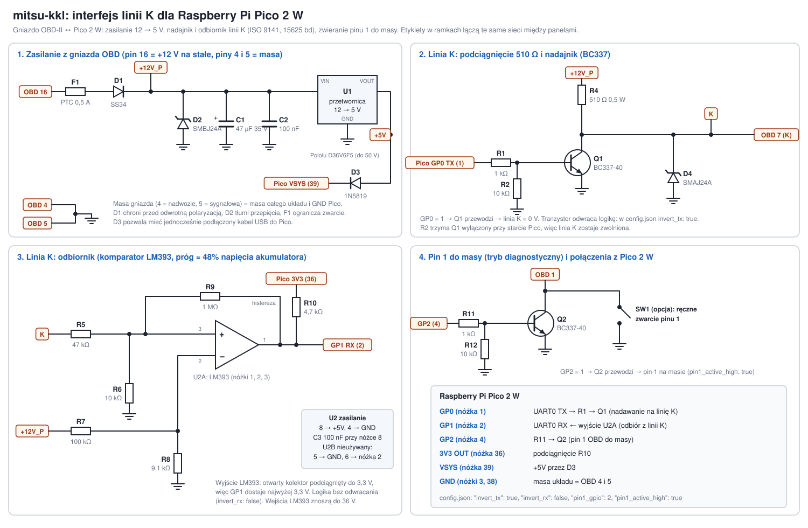

# Interfejs linii K dla Raspberry Pi Pico 2 W: schemat



Układ łączy Pico 2 W z gniazdem OBD-II starszego Mitsubishi: zasila Pico z auta, nadaje i odbiera
na linii K (MUT-II, 15625 bodów) i zwiera pin 1 do masy, żeby sterownik przeszedł w tryb
diagnostyczny. Ta sama zasada co w tanich kablach KKL (komparator + tranzystor), tylko zamiast
układu USB jest Pico. Części są popularne i przewlekane, do złożenia na płytce uniwersalnej.

> **Stan:** schemat jest zaprojektowany i sprawdzony pod względem napięć i logiki (także
> z firmware na symulatorze), ale **nie został jeszcze zbudowany ani zmierzony**. Przed pierwszym
> podłączeniem do auta zrób test stanowiskowy opisany niżej.

## Jak to działa

1. **Zasilanie.** Pin 16 gniazda ma +12 V z akumulatora zawsze, także przy wyłączonym zapłonie.
   F1 (bezpiecznik polimerowy) ogranicza prąd przy zwarciu, D1 chroni przed odwrotną polaryzacją,
   D2 (TVS) tłumi przepięcia z instalacji. Przetwornica U1 daje 5 V dla Pico (przez D3 na VSYS)
   i dla komparatora. Sieć za D1 to **+12V_P**.
2. **Nadawanie.** R4 (510 Ω) podciąga linię K do +12V_P, tak jak w testerze ISO 9141. Gdy GP0 = 1,
   tranzystor Q1 przewodzi i ściąga linię do 0 V. Stan wysoki GP0 daje więc zero na linii:
   dlatego w `config.json` jest `"invert_tx": true` (UART Pico sam odwraca sygnał, a inicjalizacja
   5 bodów uwzględnia to samo ustawienie). R2 trzyma Q1 wyłączony, zanim ruszy firmware.
3. **Odbiór.** Komparator U2 porównuje linię K (przez dzielnik R5/R6) z progiem z dzielnika R7/R8
   od +12V_P. Próg wychodzi ok. 48% napięcia akumulatora, więc działa tak samo przy 12 V
   i przy 14,4 V z ładowania. Wyjście LM393 to otwarty kolektor podciągnięty R10 do 3,3 V Pico:
   GP1 nigdy nie dostanie więcej niż 3,3 V. R9 dodaje małą histerezę przeciw zakłóceniom.
   Pico słyszy na GP1 także własne nadawanie (echo), tak jak każdy kabel KKL; firmware to uwzględnia.
4. **Pin 1.** Gdy GP2 = 1, Q2 zwiera pin 1 gniazda do masy. Firmware robi to przy łączeniu i na
   0,5 s zwalnia pin między nieudanymi próbami. SW1 (opcja) pozwala zewrzeć pin 1 ręcznie.

## Lista części

| oznaczenie | część | uwagi |
|---|---|---|
| U1 | przetwornica 5 V, np. Pololu **D36V6F5** (wejście 4–50 V, 600 mA) | alternatywa: 7805 z radiatorem (grzeje się, ok. 1,3 W) |
| F1 | bezpiecznik polimerowy (PTC) 0,5 A, 30 V+ | np. MF-R050 |
| D1 | dioda Schottky **SS34** (40 V, 3 A) | albo 1N5822 |
| D2 | TVS **SMBJ24A** (jednokierunkowa) | tłumi przepięcia na +12V_P |
| D3 | dioda Schottky **1N5819** | +5V → VSYS, pozwala mieć jednocześnie USB |
| D4 | TVS **SMAJ24A** | ochrona linii K |
| C1 | 47 µF / 35 V elektrolityczny | |
| C2, C3 | 100 nF ceramiczny | C3 przy nóżce 8 U2 |
| U2 | **LM393** (DIP-8, najlepiej w podstawce) | drugi komparator (B) nieużywany: nóżka 5 do GND, 6 do nóżki 2 |
| Q1, Q2 | **BC337-40** (NPN) | albo 2N2222A; uwaga na układ nóżek w obudowie TO-92 |
| R1, R11 | 1 kΩ | bazy Q1, Q2 |
| R2, R12 | 10 kΩ | baza–masa, trzymają tranzystory wyłączone przy starcie |
| R4 | **510 Ω, 0,5 W** | podciągnięcie linii K; przy długim stanie niskim wydziela ok. 0,3 W |
| R5 | 47 kΩ | dzielnik linii K |
| R6 | 10 kΩ | |
| R7 | 100 kΩ | dzielnik progu |
| R8 | 9,1 kΩ | |
| R9 | 1 MΩ | histereza |
| R10 | 4,7 kΩ | podciągnięcie wyjścia LM393 do 3,3 V |
| SW1 | wyłącznik (opcja) | ręczne zwarcie pinu 1 |
| J1 | wtyk OBD-II (16 pin) z przewodem | potrzebne piny 1, 4, 5, 7, 16 |
| | Raspberry Pi **Pico 2 W** | z listwami, najlepiej w gniazdach |

Rezystory 0,25 W (poza R4), tolerancja 1–5%.

## Połączenia z Pico 2 W

| Pico | nóżka | dokąd |
|---|---|---|
| GP0 (UART0 TX) | 1 | R1 → baza Q1 |
| GP1 (UART0 RX) | 2 | wyjście U2A (nóżka 1) i R10 |
| GP2 | 4 | R11 → baza Q2 |
| 3V3 OUT | 36 | R10 |
| VSYS | 39 | katoda D3 |
| GND | 3, 38 | wspólna masa, OBD 4 i 5 |

Ustawienia firmware (`pico/config.json`) pasujące do schematu: `"invert_tx": true`,
`"invert_rx": false`, `"tx_gpio": 0`, `"rx_gpio": 1`, `"pin1_gpio": 2`, `"pin1_active_high": true`.

## Uruchomienie krok po kroku

1. **Bez Pico**, zasilacz laboratoryjny 12 V z ograniczeniem prądu ok. 200 mA na OBD 16 (+) i 4/5 (−).
   Zmierz względem masy:
   - +12V_P: ok. 11,6–11,8 V (12 V minus spadek na D1),
   - +5V: 5,0 V,
   - linia K (OBD 7): tyle co +12V_P,
   - nóżka 3 U2 (wejście +): ok. 2 V; nóżka 2 (wejście −): ok. 1 V,
   - pobór prądu bez Pico: kilka mA.
2. **Z Pico** (MicroPython i firmware wgrane, patrz [../README.md](../README.md)), dalej z zasilacza:
   ```
   mpremote run pico/benchtest.py
   ```
   Test sprawdza, czy linia K jest wysoko, czy Q1 ją ściąga i zwalnia, czy przez UART wraca echo
   bajtów przy 15625 bodach, a potem na 5 s zwiera pin 1 (zmierz go wtedy względem masy, ma być ~0 V).
   Przy błędzie wypisuje, co sprawdzić.
3. **W aucie:** zapłon ON, telefon łączy się z siecią `mitsu-kkl`, strona http://192.168.4.1/.
   Dioda na Pico świeci ciągle, gdy jest połączenie ze sterownikiem.

## Uwagi

- **Pin 16 jest pod napięciem zawsze.** Pico z Wi-Fi pobiera z akumulatora ok. 0,5–1 W, czyli
  1–2 Ah na dobę. Odłączaj interfejs po jeździe albo dodaj wyłącznik zasilania.
- **Żaden sygnał powyżej 3,3 V nie może trafić na piny Pico.** Z tego powodu RX idzie przez
  komparator z otwartym kolektorem, a nie przez sam dzielnik.
- **Nie używaj transceivera LIN** (MCP2003B, TJA1021 itp.) zamiast Q1/U2: wiele z nich zwalnia linię,
  gdy TX jest nisko dłużej niż kilkadziesiąt ms, a inicjalizacja adresu 0x00 trzyma linię nisko 1,8 s.
- **Alternatywa: L9637D** (transceiver ISO 9141). Nie odwraca sygnałów (`"invert_tx": false`), ale
  pracuje z logiką 5 V: na TX potrzebny jest bufor 3,3 → 5 V (np. 74AHCT1G125), a na RX dzielnik do
  3,3 V. Poziomy i układ nóżek sprawdź w nocie katalogowej.
- Schemat rysuje skrypt `draw_schematic.py`; po zmianach w układzie uruchom
  `python pico/hw/draw_schematic.py`.
